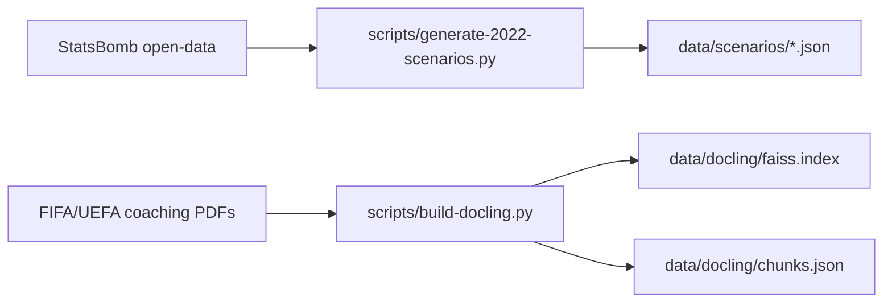

# ◇ THE DUGOUT

**You are the manager.** Step into every match of the 2022 FIFA World Cup, face real turning points, and make the tactical decision before the clock runs out. An AI analyst breaks down your choice, compares it to what the real manager did, and scores your tactical IQ across 64 scenarios.

```
  ⚽  Live 3D pitch  ·  64 matches  ·  60-second timer  ·  Multi-language AI analysis
```

---

## Why This Exists

Most football analysis is passive — you watch highlights, read match reports, or listen to pundits. The Dugout makes you the decision-maker.

Every scenario is built from **StatsBomb open event data**: real match events, real formations, real player fatigue, real scorelines at the moment of a critical turning point. You see exactly what the manager saw, choose what you would do, and learn whether it would have worked.

The app works fully offline out of the box. Live AI analysis (via local Ollama) adds depth, but every scenario ships with pre-generated tactical explanations, scoring, and counterfactuals.

---

## Features

### 🎮 Gameplay
| Feature | Detail |
|---------|--------|
| **64 match scenarios** | Every World Cup 2022 match — group stage to final — each with a real turning point drawn from match data |
| **60-second timer** | Choose from 4 tactical options before the clock hits zero |
| **Real formations** | Actual 4-3-3, 4-4-2, 3-4-3, etc. per team, with correct player positions |
| **Player fatigue** | Color-coded fatigue indicators (green → yellow → red) with popup tooltips |
| **Match momentum** | Live bar chart based on events and scoreline context |
| **Events timeline** | Interactive scrollable timeline of goals, cards, substitutions |
| **Attack zones** | Live breakdown of player distribution across defensive/middle/attacking thirds |
| **Tactical concepts** | One concept per scenario (overloads, compactness, transitions, half-spaces) with inline diagrams |
| **Counterfactuals** | Explore what might have happened if you chose differently |

### 🏟️ Visualization
| Feature | Detail |
|---------|--------|
| **3D broadcast pitch** | Full Three.js stadium with crowd, roof, floodlights, goals, and pitch markings |
| **3 camera modes** | Broadcast (TV-style), Tactical (top-down), Free (orbit controls) |
| **2D tactical board** | Canvas-based formation view with numbered players, passing lanes, and previews |
| **Tactical overlays** | Shape, pressing triggers, attack zones, passing lanes (safe/risky/blocked), defensive block |
| **Cinematic transitions** | Animated camera swoop between modes |
| **Single unified pitch texture** | 4096×6336 opaque canvas combining grass stripes, mowing patterns, and white markings — no transparency sorting artifacts |

### 🤖 AI Analysis
| Feature | Detail |
|---------|--------|
| **4 analyst personas** | Nathan (EN, England), Valeria (ES, Spain), Claire (FR, France), Lukas (DE, Germany) |
| **Streaming explanations** | Server-sent events for typewriter-effect delivery |
| **Decision DNA** | 5-axis profile per choice: difficulty, vision, risk, decisiveness, leverage |
| **Action Quality** | 0–100 score with pros/cons per decision (Outstanding → Good → Reasonable → Poor) |
| **Stakes rating** | Low → Medium → High → Decisive (stage + scoreline + difficulty) |
| **Tactical IQ** | Aggregate rating across 5 dimensions with tier labels and shareable download card |
| **Matchup fixes** | 3 tactical solutions for any critical 1v1 matchup |
| **Counterfactual timelines** | Alternate history generator with numerical option valuations |
| **Coaching library (RAG)** | Ask tactical questions, answered from FIFA/UEFA coaching PDFs via FAISS retrieval |

### 💾 Persistence
| Feature | Detail |
|---------|--------|
| **Progress tracking** | localStorage persists decisions, completion stats, and IQ across sessions |
| **Tactical IQ card** | Radar chart + tier label, downloadable as image |
| **Stage filtering** | Filter 64 scenarios by tournament round on the landing page |
| **Tournament timeline** | Visual round-by-round navigation |

---

## Quick Start

```bash
# 1. Clone
git clone https://github.com/Shivang731/the-dugout
cd the-dugout

# 2. Backend deps
pip install -r requirements.txt

# 3. Frontend deps (Three.js for the 3D pitch)
npm install

# 4. Start
python run.py
```

Open **http://localhost:8000**

### Optional: Live AI Analysis

Without this step, the app works fully offline using pre-generated explanations and local scoring.

```bash
# Install Ollama (https://ollama.ai)
ollama serve
ollama pull granite3.3:2b

# Configure (optional — defaults are fine)
echo "OLLAMA_MODEL=granite3.3:2b" > .env
echo "OLLAMA_BASE_URL=http://127.0.0.1:11434" >> .env
```

### Optional: Build the Coaching Library (RAG)

```bash
# Place FIFA/UEFA coaching PDFs in data/pdfs/, then:
python scripts/build-docling.py
```

This parses PDFs with PyMuPDF, chunks the text, and builds a **FAISS index** with `sentence-transformers/all-MiniLM-L6-v2` embeddings at `data/docling/`.

---

## Architecture

```
┌──────────────────────────────────────────────────────────┐
│                    BROWSER (Vercel)                      │
│                                                          │
│  index.html ──→ scenarios.js ──→ api.js ──┐             │
│  game.html  ──→ game.js                   │             │
│  ┌──────────────────┐   ┌──────────────┐  │             │
│  │ pitch2d.js       │   │ pitch.js     │  │             │
│  │ Canvas 2D board  │   │ Three.js 3D  │  │             │
│  │ Formations       │   │ Stadium      │  │             │
│  │ Overlays         │   │ Crowd        │  │             │
│  └──────────────────┘   │ Cameras      │  │             │
│                         │ Overlays     │  │             │
│                         └──────────────┘  │             │
│  modules/                                  │             │
│    fatigue.js  ·  iq.js                   │             │
│    library.js  ·  matchup.js              │             │
│  i18n.js  ·  analysts.js                  │             │
└──────────────────┬───────────────────────┘              │
                   │  HTTP / SSE                           │
                   ▼                                       │
┌──────────────────────────────────────────────────┐      │
│              RAILWAY (FastAPI)                    │      │
│                                                   │      │
│  ┌─────────────┐  ┌──────────────┐                │      │
│  │ fixture_    │  │ ai_client    │ ─→ Ollama      │      │
│  │ loader.py   │  │ (httpx)      │    (granite3.3)│      │
│  └──────┬──────┘  └──────┬───────┘                │      │
│         │                │                         │      │
│         ▼                ▼                         │      │
│  ┌──────────┐  ┌──────────────────┐               │      │
│  │ scenarios│  │ scoring.py       │               │      │
│  │ (JSON)   │  │ (local fallback) │               │      │
│  └──────────┘  └──────────────────┘               │      │
│                                                   │      │
│  ┌──────────────┐  ┌──────────────┐               │      │
│  │ rag_service  │  │ cache.py     │               │      │
│  │ (FAISS)      │  │ (.dugout_)   │               │      │
│  └──────────────┘  └──────────────┘               │      │
│                                                   │      │
│  Routes:                                          │      │
│    decision  ·  counterfactual  ·  insight         │      │
│    iq_rating  ·  library  ·  matchup              │      │
└──────────────────────────────────────────────────┘      │
                   │                                       │
                   ▼                                       │
┌──────────────────────────────────────────────────────────┐
│                    DATA LAYER                            │
│                                                          │
│  data/scenarios/    64 JSON files (one per match)        │
│  data/docling/      FAISS index + chunks (RAG)           │
│  data/2022/         StatsBomb open-data exports          │
│  .dugout_cache/     LRU JSON cache for AI responses      │
└──────────────────────────────────────────────────────────┘
```

### Data Flow: A Decision

```
1. User opens game.html?scenario=argentina-france-2022
2. game.js: fetchScenario(id) → GET /api/scenario/{id}
3. fixture_loader.py loads data/scenarios/argentina-france-2022.json
4. Pitch renders in 3D (pitch.js) with players, ball, crowd
5. 60-second countdown begins
6. User picks an option (A/B/C/D)
7. POST /api/decision → ai_client.py calls Ollama
8. If Ollama unavailable → scoring.py computes local scores
   + pre-generated explanation served from scenario JSON
9. Response includes: action_quality, dna, stakes, explanation
10. game.js renders: score card, pros/cons, DNA radar, analyst text
11. POST /api/counterfactual → alternate timeline from AI
12. User sees "What Really Happened" from scenario data
13. Decision saved to localStorage for IQ aggregation
```

---

## Project Structure

```
backend/
├── main.py                  # FastAPI app, CORS, static mount, root routes
├── ai_client.py             # Ollama HTTP wrapper (generate / stream / structured)
├── analyst_personas.py      # 4 personas with voice/system prompts (EN/ES/FR/DE)
├── cache.py                 # JSON disk cache with get/put/clear
├── fixture_loader.py        # Scenario loader with 5-minute TTL list cache
├── scoring.py               # Local scoring: action quality, DNA, stakes
├── rag_service.py           # FAISS + sentence-transformers RAG retrieval
└── routes/
    ├── decision.py          # POST /api/decision, GET /api/decision/stream
    ├── counterfactual.py    # POST /api/counterfactual
    ├── insight.py           # POST /api/match/insight (10-language support)
    ├── iq_rating.py         # POST /api/iq-rating
    ├── library.py           # POST /api/library
    └── matchup.py           # POST /api/matchup-fix

frontend/
├── index.html               # Landing page: hero, tournament timeline, scenario grid
├── game.html                # 3-act game: pitch + decision + analysis
├── css/
│   ├── main.css             # Design tokens, layout grid, shared components
│   ├── index.css            # Landing page styles
│   └── game.css             # Game page: pitch, scoreboard, overlays, cards
└── js/
    ├── api.js               # All fetch/SSE calls to backend
    ├── game.js              # Game controller: timer, options, modal flow, pitch init
    ├── pitch.js             # Three.js 3D engine (3643 lines)
    │                        #   Stadium, crowd, roof, floodlights, goals
    │                        #   3 camera modes + orbit controls
    │                        #   Passing lanes, defensive block, pressing overlays
    │                        #   Player models, ball physics, replay
    ├── pitch2d.js           # Canvas 2D tactical board
    │                        #   Formation layout, numbered shirts
    │                        #   Overlays: passing, shape, pressure, attack zones
    │                        #   Hover tooltip + preview scenes
    ├── scenarios.js         # Scenario grid: cards, stage filter, progress
    ├── analysts.js          # Analyst persona definitions
    ├── i18n.js              # EN/ES/FR/DE UI translations
    └── modules/
        ├── fatigue.js       # Fatigue tooltip popup
        ├── iq.js            # Tactical IQ panel + radar chart + download
        ├── library.js       # Coaching library sidebar
        └── matchup.js       # Matchup fix panel

scripts/
├── build-docling.py         # PDF → FAISS index pipeline
├── generate-2022-scenarios.py  # StatsBomb → 64 scenario JSONs
└── generate-scenarios.py    # Alternative generator

data/
├── scenarios/               # 64 JSON scenario files
├── docling/                 # FAISS index + text chunks
└── 2022/                    # StatsBomb open-data
    ├── json/                # Processed events
    ├── csv/                 # Raw exports
    └── scripts/             # Data processing
```

---

## Data: 64 Scenarios from StatsBomb

Every scenario is a JSON file traced to a real World Cup 2022 event through **StatsBomb's free open event data** (competition_id=43, season_id=106).

### Scenario JSON Structure

```json
{
  "id": "argentina-france-2022",
  "meta": {
    "title": "Argentina vs France — Final",
    "trigger_label": "Second half, locked at 3-3",
    "difficulty": 5,
    "order": 95,
    "stage": "Final",
    "date": "2022-12-18",
    "stadium": "Lusail Stadium"
  },
  "scoreline": { "home": 3, "away": 3, "display": "3-3" },
  "home_team": "Argentina",
  "away_team": "France",
  "home_formation": "4-3-3",
  "away_formation": "4-3-3",
  "context": "...",
  "options": [
    { "label": "A", "action": "Make an attacking substitution", "risk": "High" },
    { "label": "B", "action": "Push full-backs higher", "risk": "Medium" },
    { "label": "C", "action": "Stay patient, maintain shape", "risk": "Medium" },
    { "label": "D", "action": "Go ultra-attacking", "risk": "Very High" }
  ],
  "real_decision": {
    "option": "A",
    "description": "The match went to penalties..."
  },
  "home_players": [{ "name": "...", "pos": "GK", "number": 23, ... }],
  "away_players": [...],
  "replay_events": [{ "minute": 22, "type": "goal", ... }],
  "matchups": [{ "attacker": "...", "defender": "...", ... }],
  "pre_generated_explanations": { "A": "...", "B": "...", ... },
  "fatigue_popups": [...]
}
```

### Attribution

Data from StatsBomb. If you publish or distribute this project, include:

> "Data from StatsBomb"

Source: [github.com/statsbomb/open-data](https://github.com/statsbomb/open-data)

---

## API Reference

### `GET /api/ping`
Health check. Returns `{"status": "ok", "version": "2.0.0"}`.

### `GET /api/config`
App configuration: default language, available languages, AI provider and model.

### `GET /api/scenarios`
List all 64 scenarios sorted by match order (Group Stage → Final).

### `GET /api/scenario/{scenario_id}`
Full scenario detail: meta, scoreline, options, players, events, matchups, pre-generated explanations.

### `GET /api/analysts`
Available analyst personas with name, language, flag, and role.

### `POST /api/decision`
Submit a tactical decision.

**Body:**
```json
{
  "scenario_id": "argentina-france-2022",
  "user_choice": "A",
  "lang": "en"
}
```

**Response:** Explanation, action_quality, dna, stakes, comparison to real manager's choice.

### `GET /api/decision/stream`
Server-sent events (SSE) endpoint for streaming the same explanation with a typewriter effect. Query params: `scenario_id`, `user_choice`, `lang`.

### `POST /api/counterfactual`
Generate an alternate timeline + 1–10 option valuations.

```json
{
  "scenario_id": "argentina-france-2022",
  "user_choice": "B",
  "chosen_option_text": "Push the full-backs higher...",
  "lang": "en"
}
```

### `POST /api/match/insight`
Pre-match tactical insight in 10 languages (EN, ES, PT, FR, DE, IT, NL, AR, HI, JA).

### `POST /api/matchup-fix`
3 tactical solutions for a critical 1v1 matchup. Body: `{ "scenario_id": "...", "matchup_index": 0 }`.

### `POST /api/iq-rating`
Calculate Tactical IQ from completed decisions. Body: `{ "decisions": { "scenario_id": "choice", ... } }`.

**Response:** Scores across 5 dimensions, total, tier label, match count.

### `POST /api/library`
RAG-powered coaching Q&A. Body: `{ "question": "How do you defend against a high press?" }`.

Requires the FAISS index to be built (`python scripts/build-docling.py`).

---

## Scoring System

### Tactical IQ

```
              Attacking Instinct
                    │
        Pressure ◄──┼──► Defensive Pragmatism
        Management  │
                    │
           Formation ◄──► Substitution Timing
           Flexibility
```

| Dimension | What It Measures |
|-----------|-----------------|
| Attacking Instinct | Willingness to make offensive changes |
| Defensive Pragmatism | Ability to protect a lead |
| Substitution Timing | Knowing when to make changes |
| Formation Flexibility | Adapting shape to the match state |
| Pressure Management | Keeping composure under time pressure |

| Tier | Score Range |
|------|-------------|
| Scout | 0–40 |
| Coach | 41–60 |
| Gaffer | 61–80 |
| The Special One | 81–100 |

### Decision DNA

Every choice is decomposed into 5 axes (0.0–1.0):

- **Difficulty** — how hard the tactical situation was
- **Vision** — how creative/unexpected the choice was
- **Risk** — how risky the chosen option was
- **Decisiveness** — how bold/resolute the response was
- **Leverage** — how much the moment mattered (stage, scoreline, context)

### Stakes

| Level | Score Range | Context |
|-------|-------------|---------|
| Decisive | ≥ 0.80 | Knockout final, one-goal game |
| High | 0.60–0.79 | Quarter-final, tight scoreline |
| Medium | 0.40–0.59 | Group stage, moderate margin |
| Low | < 0.40 | Comfortable margin, early stages |

### Action Quality

| Label | Score |
|-------|-------|
| Outstanding | ≥ 80 |
| Good | 65–79 |
| Reasonable | 45–64 |
| Poor | < 45 |

---

## Configuration

### Environment Variables

```bash
OLLAMA_MODEL=granite3.3:2b      # Default AI model
OLLAMA_BASE_URL=http://127.0.0.1:11434  # Ollama server
OLLAMA_TIMEOUT=180              # Request timeout (seconds)
AI_PROVIDER=ollama              # Provider label (for /api/config)
```

### 3D Pitch Constants

Key dimensions in `pitch.js`:

```
PITCH_W = 68 m    PITCH_L = 105 m    HALF_W = 34 m    HALF_L = 52.5 m
CENTER_R = 9.15 m  PEN_AREA_W = 40.3 m  PEN_AREA_L = 16.5 m
SIX_YARD_W = 18.3 m  SIX_YARD_L = 5.5 m  CORNER_R = 1 m
GOAL_W = 7.32 m  GOAL_H = 2.44 m  GOAL_D = 2 m
```

Unified pitch texture: 4096 × 6336 px, mipmaps disabled, `LinearFilter`.

---

## Deployment

### Backend (Railway)

```bash
uvicorn backend.main:app --host 0.0.0.0 --port $PORT
```

The `Procfile` does this automatically. Environment variables (OLLAMA_MODEL, etc.) can be set in Railway dashboard or via `.env`.

### Frontend (Vercel)

`vercel.json` serves the `frontend/` directory and rewrites `/api/*` to the Railway backend:

```json
{
  "outputDirectory": "frontend",
  "rewrites": [
    {
      "source": "/api/(.*)",
      "destination": "https://the-dugout.up.railway.app/api/$1"
    }
  ]
}
```

---

## Development Notes

### Frontend Quirks

- **No framework, no TypeScript, no build tool.** Pure HTML/CSS/JS.
- **Three.js r128** loaded from CDN — no bundling needed.
- **pitch.js** (3643 lines) is the largest file — 3D stadium, crowd, players, ball, cameras, overlays, replay engine.
- **game.js** (1697 lines) is the game controller — timer, modals, scoreboard, API orchestration.
- **pitch2d.js** — canvas 2D tactical board, no framework dependency.
- All textures are procedurally generated on canvas (no external image assets).

### Backend Quirks

- **Single-process FastAPI** — serves both API and static files.
- **No database** — all state is in JSON files on disk or localStorage.
- **No test suite** — the project has no test framework configured.
- **CORS** allows all origins (`allow_origins=["*"]`).

### Data Pipeline



### Tactical Concepts Per Scenario

Each scenario teaches one tactical concept:
- Overloads · Compactness · Transitions · Half-spaces
- Defensive block · Pressing triggers · Width & depth
- Rest-defense · Counter-pressing · Mid-block
- Low block · High line · Cover shadows

---

## Tech Stack

| Layer | Technology |
|-------|-----------|
| **Backend** | Python 3.10+, FastAPI, uvicorn |
| **Frontend** | Vanilla HTML/CSS/JS |
| **3D Rendering** | Three.js r128 |
| **2D Rendering** | Canvas 2D API |
| **AI** | Ollama (local, granite3.3:2b) |
| **RAG** | Docling → PyMuPDF → FAISS + sentence-transformers (all-MiniLM-L6-v2) |
| **HTTP** | httpx (async) |
| **Data** | StatsBomb open-data |

---

## License

This project uses **StatsBomb open-data** (competition_id=43, season_id=106).

> "Data from StatsBomb"

Source: [github.com/statsbomb/open-data](https://github.com/statsbomb/open-data)

---

*Built for the IBM SkillsBuild June Challenge 2026*
